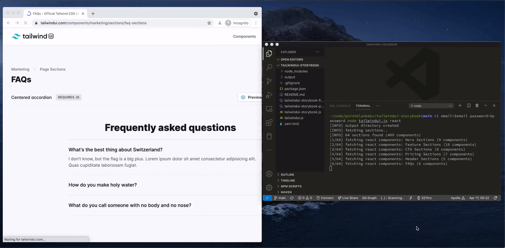
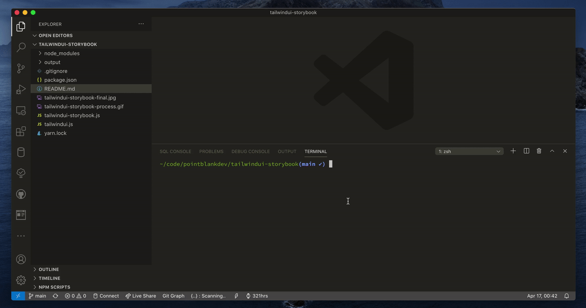
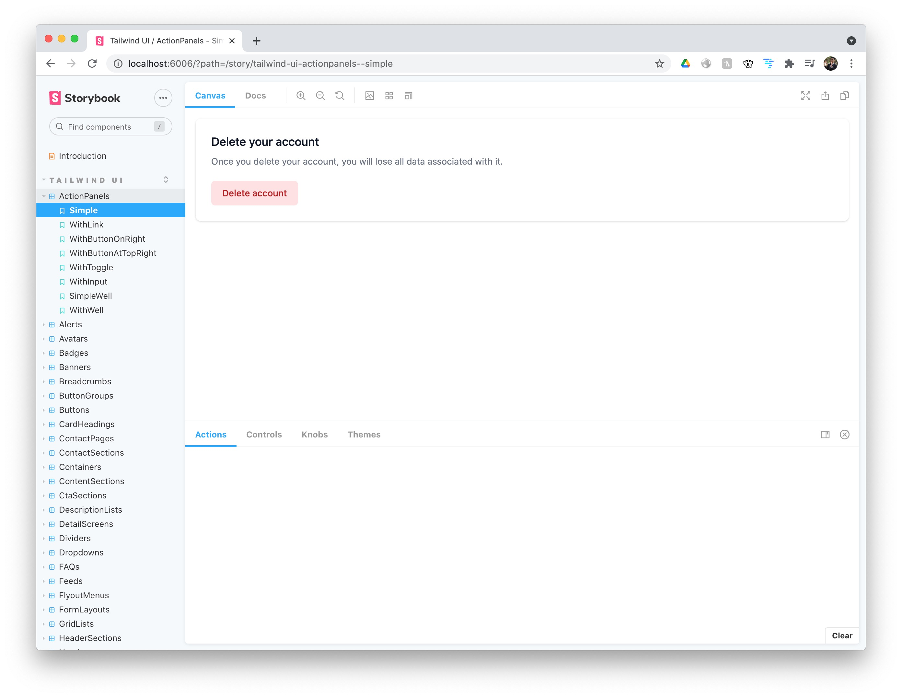

<p align="center">

</p>

## What is this?

We first used this script to generate Tailwind UI components for one of our projects. The idea is to use Tailwind UI components right from the storybook in our repo, without having to visit Tailwind UI website.

## How it works?

The flow consists of 2 steps:

1. fetching components data from tailwindui.com (using chromium that is automated by playwright)
2. using that data to generate storybook files (mdx).

The two steps process makes it easy to adjust for future needs.

- If tailwindui.com changes and we need to adjust the scraper, change `tailwindui.js`
- If we need to adjust the structure of the generated mdx files, change `tailwindui-storybook.js`

## Usage

1. Make sure you have Tailwind UI license and have the login info for tailwindui.com
2. Clone the repo and run `yarn` to install the dependencies
3. Get list of components from tailwindui.com (react/vue/html):

   ```sh
   # Format:
   email=<youremail@mail.com> password=<yourpassword> node tailwindui.js <react|vue|html>

   # Example:
   email='hey@example.com' password='pass123' node tailwindui.js react
   ```

   The command will start chromium and navigate thru tailwindui.com website to copy the components codes. Here's how it looks like:

   

4. Once done, you'll have new file at `output/tailwindui-<react|vue|html>.json`.
5. Now we can create the mdx files based on above json. To do so, run:

   ```sh
   # Replace `react.json` suffix with `vue.json` as you fit
   node tailwindui-storybook.js ./output/tailwindui.react.json react
   ```

   

At this point, you will have new folder called `output/tailwindui-react` where it contains the stories and components. You can copy this folder to your repo and connect it to storybook.

Here's how the structure looks like once connected to Storybook:



## Disclaimer

This tool does not contain any Tailwind UI codes. It only helps you get the codes from tailwindui.com and generate the corresponding story files for your storybook. This means that to use this tool, you need to have a Tailwind UI license and a correct login credentials for tailwindui.com.

No credentials are stored or sent to any third-party endpoints.

**

_That's it. Thanks!_
